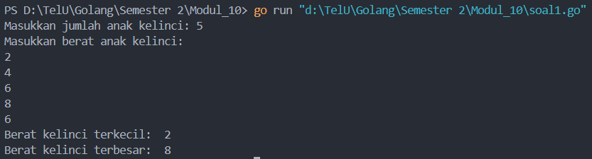
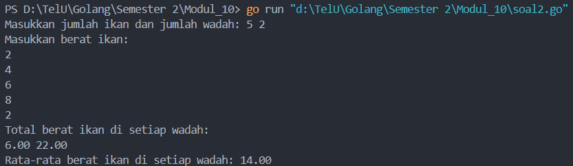
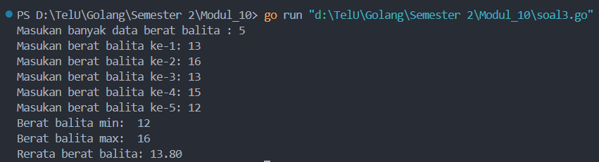

<h1 align="center">Laporan Praktikum Modul 10 <br> PENCARIAN NILAI EKSTRIM PADA HIMPUNAN DATA </h1>
___
<h4 align="center">Nanda Bagus Priambodo - 103112430007 </h4>
### Dasar Teori STRUCT & ARRAY

**Struct** dalam Go adalah tipe data yang memungkinkan kita untuk mengelompokkan beberapa elemen dengan tipe yang berbeda menjadi satu entitas. Setiap elemen dalam struct disebut field, dan kita bisa mengaksesnya dengan menggunakan nama field. Sedangkan **array** adalah struktur data yang menyimpan elemen-elemen dengan tipe yang sama dalam urutan yang tetap, dengan ukuran yang telah ditentukan sebelumnya dan tidak dapat berubah selama program berjalan. Meskipun keduanya digunakan untuk menyimpan data, struct lebih fleksibel untuk menyimpan data yang heterogen (berbeda tipe), sementara array lebih cocok untuk data yang homogen (bertipe sama) dengan jumlah elemen yang tetap.

### Unguided
___
##### Soal Latihan Modul 10

### soal 1

Sebuah program digunakan untuk mendata berat anak kelinci yang akan dijual ke pasar. Program ini menggunakan array dengan kapasitas 1000 untuk menampung data berat anak kelinci yang akan dijual.

Masukan terdiri dari sekumpulan bilangan, yang mana bilangan pertama adalah bilangan bulat N yang menyatakan banyaknya anak kelinci yang akan ditimbang beratnya. Selanjutnya N bilangan riil berikutnya adalah berat dari anak kelinci yang akan dijual.

Keluaran terdiri dari dua buah bilangan riil yang menyatakan berat kelinci terkecil dan terbesar.

```go
package main

import "fmt"

func masukData(jumlahKelinci int) [1000]int {
    var berat [1000]int

    fmt.Println("Masukkan berat anak kelinci:")
    for i := 0; i < jumlahKelinci; i++ {
        fmt.Scan(&berat[i])
    }
    return berat
}

func besatKecil(jumlahKelinci int, berat [1000]int) (int, int) {
    var terkecil, terbesar int
    terkecil = berat[0]
    terbesar = berat[0]

    for i := 0; i < jumlahKelinci; i++ {
        if berat[i] < terkecil {
            terkecil = berat[i]
        }
        if berat[i] > terbesar {
            terbesar = berat[i]
        }
    }
    return terkecil, terbesar
}

func main() {
    var jumlahKelinci int
    fmt.Print("Masukkan jumlah anak kelinci: ")
    fmt.Scan(&jumlahKelinci)

    if jumlahKelinci <= 0 || jumlahKelinci > 1000 {
        return
    }

    berat := masukData(jumlahKelinci)
    terkecil, terbesar := besatKecil(jumlahKelinci, berat)

    fmt.Println("Berat kelinci terkecil: ", terkecil)
    fmt.Println("Berat kelinci terbesar: ", terbesar)
}
```

  
>Code di atas merupakan code mencari nilai tertinggi dan ter rendah dari kelinci dan untuk inputan sesuai dengan apa yang dimau oleh user, kapasitas maksimal arraya adalah 1000 aku akan membahas mulai dari function main yaiyu terdapat inputan user lalu akan ada sebuah validasi atau percabangan jika nilai 0 / leboh dari 1000 maka sistem tidak berjalan lalu jika lolos akan di masukan kedalam function masukData yaitu mengisi data kedalam array dan setelah itu akan masuk kedalam functionbesarKecil untuk mencari tahu nilai max dan min menggunakan perulangan

### soal 2

Sebuah program digunakan untuk menentukan tarif ikan yang akan dijual ke pasar. Program ini menggunakan array dengan kapasitas 1000 untuk menampung data berat ikan yang akan dijual.

Masukan terdiri dari dua baris, yang mana baris pertama terdiri dari dua bilangan bulat x dan y. Bilangan x menyatakan banyaknya ikan yang akan dijual, sedangkan y adalah banyaknya ikan yang akan dimasukan ke dalam wadah. Baris kedua terdiri dari sejumlah x bilangan riil yang menyatakan banyaknya ikan yang akan dijual.

Keluaran terdiri dari dua baris. Baris pertama adalah kumpulan bilangan riil yang menyatakan total berat ikan di setiap wadah (jumlah wadah tergantung pada nilai x dan y, urutan ikan yang dimasukan ke dalam wadah sesuai urutan pada masukan baris ke-2). Baris kedua adalah sebuah bilangan riil yang menyatakan berat rata-rata ikan di setiap wadah.
```go
package main

import "fmt"

func MasukkanData(x int) []float64 {
    var berat []float64
    var a float64

    fmt.Println("Masukkan berat ikan:")
    for i := 0; i < x; i++ {
        fmt.Scan(&a)
        berat = append(berat, a)
    }
    return berat
}

func totalBeratWadah(x, y int, berat []float64) []float64 {
    var totalBerat []float64
    var total float64

    for i := 0; i < y; i++ {
        for j := i * x / y; j < (i+1)*x/y && j < x; j++ {
            total += berat[j]
        }
        totalBerat = append(totalBerat, total)
    }
    return totalBerat
}

func hitungRataRata(totalBerat []float64, y int) float64 {
    var totalIkan float64
    for _, berat := range totalBerat {
        totalIkan += berat
    }
    return totalIkan / float64(y)
}

func main() {
    var x, y int

    fmt.Print("Masukkan jumlah ikan dan jumlah wadah: ")
    fmt.Scan(&x, &y)

    if x <= 0 || y <= 0 || x > 1000 || y > 1000 {
        fmt.Println("Jumlah ikan atau wadah tidak valid.")
        return
    }

    berat := MasukkanData(x)
    totalBerat := totalBeratWadah(x, y, berat)
    rataRata := hitungRataRata(totalBerat, y)

    fmt.Println("Total berat ikan di setiap wadah:")
    for _, berat := range totalBerat {
        fmt.Printf(berat)
    }

    fmt.Printf("Rata-rata berat ikan di setiap wadah: %.2f\n", rataRata)
}
```
 
>Code di atas merupakan program untuk menghitung total berat ikan dalam wadah dan rata-rata berat ikan di setiap wadah. Program ini menerima input jumlah ikan dan wadah dari user, kemudian melakukan validasi agar input tidak kurang dari 1 dan tidak lebih dari 1000. Setelah itu, program akan memasukkan data berat ikan ke dalam array menggunakan fungsi MasukkanData. Kemudian, berat ikan akan dibagi ke dalam wadah dengan perhitungan yang dilakukan di fungsi totalBeratWadah. Setelah itu, fungsi hitungRataRata digunakan untuk menghitung rata-rata berat ikan di setiap wadah. Hasilnya akan ditampilkan berupa total berat ikan di setiap wadah dan rata-rata berat ikan di setiap wadah.

### soal 3

Pos Pelayanan Terpadu (posyandu) sebagai tempat pelayanan kesehatan perlu mencatat data berat balita (dalam kg). Petugas akan memasukkan data tersebut ke dalam array. Dari data yang diperoleh akan dicari berat balita terkecil, terbesar, dan reratanya.

```go
package main

import "fmt"

type arrBalita [100]float64

func TambahdataBalita(arrBalita *arrBalita, jumlahBayi int) {
    for i := 0; i < jumlahBayi; i++ {
        fmt.Printf("Masukan berat balita ke-%d: ", i+1)
        fmt.Scan(&arrBalita[i])
    }
}

func hitungMinMax(arrBalita arrBalita, jumlahBayi int, bMin, bMax *float64) {
    *bMin = arrBalita[0]
    *bMax = arrBalita[0]
    
    for i := 1; i < jumlahBayi; i++ {
        if arrBalita[i] < *bMin {
            *bMin = arrBalita[i]
        }
        if arrBalita[i] > *bMax {
            *bMax = arrBalita[i]
        }
    }
}

func rataRata(arrBalita arrBalita, jumlahBayi int) float64 {
    var total float64

    for i := 0; i < jumlahBayi; i++ {
        total += arrBalita[i]
    }
    return total / float64(jumlahBayi)
}

func main() {

    var jumlahBayi int
    var beratBalita arrBalita
    var bMin, bMax, average float64

    fmt.Print("Masukan banyak data berat balita : ")
    fmt.Scan(&jumlahBayi)

    TambahdataBalita(&beratBalita, jumlahBayi)
    hitungMinMax(beratBalita, jumlahBayi, &bMin, &bMax)

    average = rataRata(beratBalita, jumlahBayi)

    fmt.Println("Berat balita min: ", bMin)
    fmt.Println("Berat balita max: ", bMax)
    fmt.Printf("Rerata berat balita: %.2f", average)
}
```


>Code di atas merupakan program untuk mencari nilai berat balita terendah, tertinggi, dan rata-rata berdasarkan input dari user. Program ini menggunakan array untuk menampung data berat balita yang dimasukkan oleh petugas. Kapasitas maksimal array yang digunakan adalah 100 elemen. pada fungsi main dilakukan input  dari user lalu pemrosesan data tersebut dengan memanggil beberapa fungsi yaitu menambahkan data kedalam array, mencari data terendah dan tertinggi dan yang terakhir function dari Rata rata.