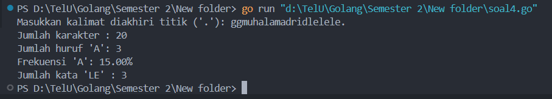

<h1 align="center">Laporan Praktikum Modul 18 <br> MESIN ABSTRAK </h1>
___
<h4 align="center">Nanda Bagus Priambodo - 103112430007 </h4>
### Dasar Teori Mesin Abstrak

Model komputasi terdiri dari data yang dapat diolah dan operasi-operasi dasar pengolahan data tersebut. Mesin abstrak adalah model komputasi yang dirancang di atas model mesin komputasi yang telah ada, yaitu tipe data dan operasi-operasi dasarnya dibuat menggunakan tipe data dan operasi-operasi yang tersedia di mesin di bawahnya. Teknik ini merupakan salah satu cara untuk membangun perangkat lunak.

___
## Unguided

### soal 4

Implementasi mesin abstrak karakter yang bekerja terhadap untaian karakter (yang diakhiri dengan penanda titik (".") dan mempunyai sejumlah operasi dasar.
a)
Operasi dasar mesin karakter:
➢ Prosedur start(); yang menyiapkan mesin karakter di awal rangkaian karakter.
➢ Prosedur maju(); yang memajukan pembaca ke posisi karakter berikutnya.
➢ Fungsi eop(); yang mengembalikan nilai true apabila sudah mencapai akhir rangkaian, sampai ke penanda titik (".").
➢ Fungsi cc(); yang mengembalikan karakter yang sedang terbaca, atau berada pada posisi pembacaan mesin.

b)
Dengan operasi dasar di atas buat algoritma untuk:
➢ Membaca seluruh karakter yang diberikan ke mesin karakter tersebut.
➢ Menghitung berapa banyak karakter yang terbaca.
➢ Menghitung ada berapa huruf "A" yang terbaca.
➢ Menghitung frekuensi kemunculan huruf "A" terhadap seluruh karakter terbaca.
➢ Menghitung ada berapa kata "LE" (pasangan berturutan huruf "L" dan "E") yang terbaca.

```go
package main

import (
    "fmt"
    "strings"
)

var input string
var index int
var karakter byte

func start() {

    index = 0
    karakter = input[index]

}

func maju() {
    index++
    if index < len(input) {
        karakter = input[index]
    }
}

func cc() byte {
    return karakter
}

func eop() bool {
    return karakter == '.'
}

func main() {
    fmt.Print("Masukkan kalimat diakhiri titik ('.'): ")
    fmt.Scanln(&input)

    if !strings.HasSuffix(input, ".") {
        fmt.Println("Input harus diakhiri dengan titik ('.')")
        return
    }

    start()

    jumlahKarakter := 0
    jumlahA := 0
    jumlahLE := 0
    
    var prev byte = 0

    for !eop() {
        c := cc()
        jumlahKarakter++

        if strings.ToUpper(string(c)) == "A" {
            jumlahA++
        }

        if strings.ToUpper(string(prev)) == "L" && strings.ToUpper(string(c)) == "E" {
            jumlahLE++
        }

        prev = c
        maju()

    }

    frekuensi := float64(jumlahA) / float64(jumlahKarakter) * 100

    fmt.Println("Jumlah karakter   :", jumlahKarakter)
    fmt.Println("Jumlah huruf 'A'  :", jumlahA)
    fmt.Printf("Frekuensi 'A'     : %.2f%%\n", frekuensi)
    fmt.Println("Jumlah kata 'LE'  :", jumlahLE)
}
```

  
>Program ini adalah program abstrak karakter. Fungsi **start** menginisialisasi user pada awal untaian, mengatur index ke posisi pertama dan mengambil karakter . Fungsi **maju()** bertanggung jawab untuk memajukan index ke karakter berikutnya dan memperbarui karakter. Fungsi **eop** melakukan pengecekan apakah karakter terdapat penanda titik (.) . Pada fungsi **main**,  pertama-tama meminta masukan kalimat dari user dan melakukan validasi untuk memastikan kalimat diakhiri dengan titik. Setelah benar, mesin karakter dimulai menggunakan start(). Selanjutnya, dilakukan iterasi selama kondisi !eop() terpenuhi, di mana setiap karakter diambil melalui cc(), kemudian dilakukan beberapa perintah seperti: penghitungan total karakter, penghitungan kemunculan huruf 'A', dan penghitungan karakter "LE" dengan variabel untuk menyimpan karakter sebelumnya. Setelah setiap karakter diproses, fungsi maju() dipanggil. Setelah iterasi selesai, program menghitung frekuensi kemunculan huruf 'A' dalam persentase dan menampilkan seluruh hasil analisis, meliputi jumlah total karakter, jumlah huruf 'A', frekuensi 'A', dan jumlah sekuens "LE".
