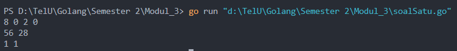
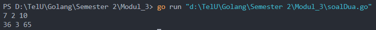

<h1 align="center">Laporan Praktikum Modul 3 <br> REVIEW PENGENALAN PEMROGRAMAN </h1>
___
<h5 align="center">Nanda Bagus Priambodo - 103112430007 </h5>
### Dasar Teori

Golang adalah bahasa pemrograman yang dikembangkan oleh Google dan dirilis pada tahun 2009. Bahasa ini dirancang untuk menjadi sederhana, efisien, dan mudah digunakan, dengan sintaksis yang bersih dan jelas. Go mendukung pemrograman berorientasi objek, tetapi tidak memiliki pewarisan kelas tradisional; sebaliknya, ia menggunakan komposisi dan antarmuka untuk mencapai polimorfisme. Salah satu fitur utama Go adalah dukungan bawaan untuk pemrograman konkuren melalui goroutine dan channel, yang memungkinkan pengembang untuk menulis aplikasi yang dapat menangani banyak tugas secara bersamaan dengan efisien. Go juga memiliki pengelolaan memori otomatis melalui garbage collection, serta alat pengembangan yang kuat, termasuk sistem manajemen paket dan alat untuk pengujian dan profiling, menjadikannya pilihan populer untuk pengembangan aplikasi server, sistem, dan layanan cloud.

### Unguided
___
#### Soal Latihan 3

##### soal 1

Minggu ini, mahasiswa Fakultas Informatika mendapatkan tugas dari mata kuliah matematika diskrit untuk mempelajari kombinasi dan permutasi. Jonas salah seorang mahasiswa, iseng untuk mengimplementasikannya ke dalam suatu program. Oleh karena itu bersediakah kalian membantu Jonas? (tidak tentunya ya :p)

Masukan terdiri dari empat buah bilangan asli 𝑎, 𝑏, 𝑐, dan 𝑑 yang dipisahkan oleh spasi, dengan syarat 𝑎≥ 𝑐 dan 𝑏≥ 𝑑.

Keluaran terdiri dari dua baris. Baris pertama adalah hasil permutasi dan kombinasi 𝒂 terhadap 𝑐, sedangkan baris kedua adalah hasil permutasi dan kombinasi 𝑏 terhadap 𝑑.
Catatan: permutasi (P) dan kombinasi (C) dari 𝑛 terhadap 𝑟 (𝑛≥𝑟) dapat dihitung dengan menggunakan persamaan berikut!

```go
package main
import (
    "fmt"
) 
func faktorial(n int) int {
    if n == 0 {
        return 1
    }
    result := 1
    for i := 2; i <= n; i++ {
        result *= i
    }
    return result
}

func permutasi(n, r int) int {
    return faktorial(n) / faktorial(n-r)
}

func kombinasi(n, r int) int {
    return faktorial(n) / (faktorial(r) * faktorial(n-r))
}

func main() {
    var a, b, c, d int
    fmt.Scan(&a, &b, &c, &d)
    if a < c || b < d {
        fmt.Print("Silahkan masukan bilangan awal dan tengah lebih besar")
    } else {
        permutasi1 := permutasi(a, c)
        kombinasi1 := kombinasi(a, c)
        permutasi2 := permutasi(b, d)
        kombinasi2 := kombinasi(b, d)

        fmt.Println(permutasi1, kombinasi1)
        fmt.Println(permutasi2, kombinasi2)
    }
}
```

  
>Penjelasan code di atas adalah permutasi dan kombinasi, terdapat 4 bauh function yaitu faktorial, permutasi, kombinasi dan main berikutnya saya akan jelaskan detail dari masing masing funtion4
>
>Untuk function main:
>Fungsi ini meminta user untuk memasukkan 4 buah bilangan dan selanjutnya sistem akan mengecek menggunakan percabangan if else atau jika bilangan 1 lebih kecil dari bilangan 3 maka program akan berhenti
>
>Function Faktorial:
>Fungsi ini meminta sebuah value dari variabel atau masukan user dengan keluaran integer, terdapat sebuah loop untuk menentukan faktorial sampai faktorial itu 0, jika user menginputkan 3 maka perkaliannya adalah 3x2x1 lalu fungsi ini akan mengembalikan sebuah value return berupa faktorial yang akan di lanjutkan oleh fungction permutasi dan kombinasi
>
>Function Permutasi:
>fungsi ini akan menerima hasil faktorial dari function mutasi yang membawa value kemudian akan di bagi dengan faktorial - nilai r atau semisal kita memasukan nilai a = 5 b = 3 maka nilai r adalah 5-3, fungsi ini tidak membalikan nilai karena tidak terdapat return
>
>Function Kombinasi:
>Hampir sama seperti permutasi cuman yang membedakan adalah pembaginya

##### soal 2

Diberikan tiga buah fungsi matematika yaitu 𝑓 (𝑥) = 𝑥2 , 𝑔 (𝑥)= 𝑥−2 dan ℎ (𝑥)= 𝑥+1. Fungsi komposisi (𝑓𝑜𝑔𝑜ℎ)(𝑥) artinya adalah 𝑓(𝑔(ℎ(𝑥))). Tuliskan 𝑓(𝑥), 𝑔(𝑥) dan ℎ(𝑥) dalam bentuk function.

```go
package main
import "fmt"

func f(x int) int {
    var rumus int
    rumus = x * x
    return rumus
}

func g(x int) int {
    var rumus int
    rumus = x - 2
    return rumus
}

func h(x int) int {
    var rumus int
    rumus = x + 1
    return rumus
}

func main() {
    var x1, x2, x3, fogoh, gohof, hofog int
    fmt.Scan(&x1, &x2, &x3)

    fogoh = f(g(h(x1)))
    gohof = g(h(f(x2)))
    hofog = h(f(g(x3)))

    fmt.Println(fogoh, gohof, hofog)
}
```

  
>Penjelasan code di atas adalah permutasi dan kombinasi, terdapat 4 bauh function yaitu faf,g,h dan main berikutnya saya akan jelaskan detail dari masing masing funtion
>
>Untuk function main:
>Fungsi ini meminta user untuk memasukkan 4 buah bilangan dan menjalankan 3 fungsi yaitu f,g,h
>
>Function f:
>fungsi f adalah mengkalikan value masukan atau value yang di inputkan oleh user atau menerima dari return value function lain (x * x)
>
>Function g:
>fungsi ini akan menerima hasil return dari function lain atau inputan langsung dari user dengan rumus (x-2)
>
>Function h:
>fungsi ini akan menerima hasil return dari function lain atau inputan langsung dari user dengan rumus (x+1)

##### soal 3

Suatu lingkaran didefinisikan dengan koordinat titik pusat (𝑐𝑥,𝑐𝑦) dengan radius 𝑟. Apabila diberikan dua buah lingkaran, maka tentukan posisi sebuah titik sembarang (𝑥,𝑦) berdasarkan dua lingkaran tersebut.

```go
package main
import (

    "fmt"
    "math"
)

func main() {
    var X1, Y1, X2, Y2, radius1, radius2, pointX, pointY float64
    var lingkaran1, lingkaran2 bool

    fmt.Print("Masukkan koordinat pusat dan radius lingkaran 1: ")
    fmt.Scan(&X1, &Y1, &radius1)

    fmt.Print("Masukkan koordinat pusat dan radius lingkaran 2: ")
    fmt.Scan(&X2, &Y2, &radius2)

    fmt.Print("Masukkan koordinat titik (x y): ")
    fmt.Scan(&pointX, &pointY)

    lingkaran1 = didalam(X1, Y1, radius1, pointX, pointY)
    lingkaran2 = didalam(X2, Y2, radius2, pointX, pointY)

    if lingkaran1 && lingkaran2 {
        fmt.Println("Titik di dalam lingkaran 1 dan 2")
    } else if lingkaran1 {
        fmt.Println("Titik di dalam lingkaran 1")
    } else if lingkaran2 {
        fmt.Println("Titik di dalam lingkaran 2")
    } else {
        fmt.Println("Titik di luar lingkaran 1 dan 2")
    }
}

  

func jarak(x1, y1, x2, y2 float64) float64 {
    return math.Sqrt(math.Pow(x1-x2, 2) + math.Pow(y1-y2, 2))
}

func didalam(X, Y, radius, pointX, pointY float64) bool {
    return jarak(X, Y, pointX, pointY) <= radius
}
```

  
>Program ini menghitung apakah suatu titik berada di dalam dua lingkaran yang ditentukan oleh user. Pertama, program meminta pengguna untuk memasukkan koordinat pusat dan radius dari dua lingkaran, serta koordinat titik yang ingin diperiksa. Fungsi `didalam` digunakan untuk menentukan apakah titik tersebut berada dalam lingkaran dengan menghitung jarak antara titik dan pusat lingkaran menggunakan fungsi `jarak`. Setelah memeriksa kedua lingkaran, program mencetak hasilnya, menunjukkan apakah titik tersebut berada di dalam salah satu atau kedua lingkaran, atau di luar keduanya.