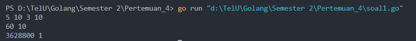
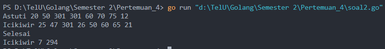
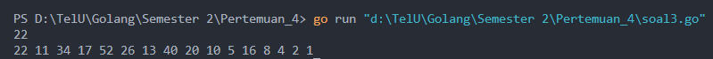

<h1 align="center">Laporan Praktikum Modul 4 <br> PROSEDUR </h1>
___
<h5 align="center">Nanda Bagus Priambodo - 103112430007 </h5>
### Dasar Teori

Golang adalah bahasa pemrograman yang dikembangkan oleh Google dan dirilis pada tahun 2009. Bahasa ini dirancang untuk menjadi sederhana, efisien, dan mudah digunakan, dengan sintaksis yang bersih dan jelas. Go mendukung pemrograman berorientasi objek, tetapi tidak memiliki pewarisan kelas tradisional; sebaliknya, ia menggunakan komposisi dan antarmuka untuk mencapai polimorfisme. Salah satu fitur utama Go adalah dukungan bawaan untuk pemrograman konkuren melalui goroutine dan channel, yang memungkinkan pengembang untuk menulis aplikasi yang dapat menangani banyak tugas secara bersamaan dengan efisien. Go juga memiliki pengelolaan memori otomatis melalui garbage collection, serta alat pengembangan yang kuat, termasuk sistem manajemen paket dan alat untuk pengujian dan profiling, menjadikannya pilihan populer untuk pengembangan aplikasi server, sistem, dan layanan cloud.

### Unguided
___
#### Soal Latihan Modul 4

##### soal 1

Minggu ini, mahasiswa Fakultas Informatika mendapatkan tugas dari mata kuliah matematika diskrit untuk mempelajari kombinasi dan permutasi. Jonas salah seorang mahasiswa, iseng untuk mengimplementasikannya ke dalam suatu program. Oleh karena itu bersediakah kalian membantu Jonas?

Masukan terdiri dari empat buah bilangan asli 𝑎, 𝑏, 𝑐, dan 𝑑 yang dipisahkan oleh spasi, dengan syarat 𝑎≥ 𝑐 dan 𝑏≥ 𝑑.

Keluaran terdiri dari dua baris. Baris pertama adalah hasil permutasi dan kombinasi 𝒂 terhadap 𝑐, sedangkan baris kedua adalah hasil permutasi dan kombinasi 𝑏 terhadap 𝑑.
Catatan: permutasi (P) dan kombinasi (C) dari 𝑛 terhadap 𝑟 (𝑛≥𝑟) dapat dihitung dengan menggunakan persamaan berikut!

>


```go
package main
import "fmt"

func main() {
    var bil1, bil2, bil3, bil4 int
    var permutasiA, permutasiB, kombinasiA, kombinasiB int

    fmt.Scan(&bil1, &bil2, &bil3, &bil4)
 
    if bil1 >= bil3 && bil2 >= bil4 {
        permutasi(bil1, bil3, &permutasiA)
        kombinasi(bil1, bil3, &kombinasiA)
        permutasi(bil2, bil4, &permutasiB)
        kombinasi(bil2, bil4, &kombinasiB)
        fmt.Println(permutasiA, kombinasiA)
        fmt.Println(permutasiB, kombinasiB)

    } else {
        fmt.Print("Syarat tida terpenuhi")
    }
}

func factorial(n int, hasil *int) {
    *hasil = 1
    for i := 1; i <= n; i++ {
        *hasil *= i
    }
}  

func permutasi(n, r int, hasil *int) {
    var factN, factNR int
    factorial(n, &factN)
    factorial(n-r, &factNR)
    *hasil = factN / factNR
}

func kombinasi(n, r int, hasil *int) {
    var factN, factR, factNR int

    factorial(n, &factN)
    factorial(r, &factR)
    factorial(n-r, &factNR)
    *hasil = factN / (factR * factNR)
}
```

  
>Penjelasan code di atas adalah permutasi dan kombinasi, terdapat 4 bauh function yaitu faktorial, permutasi, kombinasi dan main berikutnya saya akan jelaskan detail dari masing masing function

```go
func main() {
    var bil1, bil2, bil3, bil4 int
    var permutasiA, permutasiB, kombinasiA, kombinasiB int

    fmt.Scan(&bil1, &bil2, &bil3, &bil4)
  
    if bil1 >= bil3 && bil2 >= bil4 {
        permutasi(bil1, bil3, &permutasiA)
        kombinasi(bil1, bil3, &kombinasiA)
        permutasi(bil2, bil4, &permutasiB)
        kombinasi(bil2, bil4, &kombinasiB)
        fmt.Println(permutasiA, kombinasiA)
        fmt.Println(permutasiB, kombinasiB)

    } else {
        fmt.Print("Syarat tida terpenuhi")
    }
}
```
>Untuk function main:
>Fungsi ini meminta user untuk memasukkan 4 buah bilangan dan selanjutnya sistem akan mengecek menggunakan percabangan if else atau jika bilangan 1 lebih kecil dari bilangan 3 dan bilangan 2 lebih besar sama dengan bilangan 4 maka program akan berhenti. Selanjutnya jika percabangan menuju ke benar maka proses selanjutnya adalah pemanggilan prosedur mulai dari permutasi dan kombinasi, untuk parameter di dalamnya adalah nilai atau value yang ingin kita serahkan atau eksekusi ke dalam prosedur dan untuk variabel yang di awali dengan & adalah variabel yang memiliki value dari pointer atau pass by reference (pointer)

```go
func factorial(n int, hasil *int) {
    *hasil = 1
    for i := 1; i <= n; i++ {
        *hasil *= i
    }
}
```
>Prosedur Faktorial:
>Prosedur ini adalah prosedur faktorial dengan konsep looping dari value yang diberikan oleh function menu, dengan masukan adalah sebuah variabel n dalam bentuk integer lalu output adalah sebuah pointer yang di simpan di dalam hasil dalam sebuah variabel yang di dahului oleh bintang yang menandakan pass by reference(pointer) lalu loop yang di jalankan adalah mengkalikan semua bilangan yang di terima oleh fungsi atau prosedur lain

```go
func permutasi(n, r int, hasil *int) {
    var factN, factNR int
    factorial(n, &factN)
    factorial(n-r, &factNR)
    *hasil = factN / factNR
}
```
>Prosedur Permutasi:
>Prosedur ini akan menerima hasil faktorial dari prosedur factorial yang membawa value sebuah hasil dari pointer kemudian akan di bagi dengan faktorial - nilai r atau semisal kita memasukan nilai a = 5 b = 3 maka nilai r adalah 5-3, fungsi ini tidak membalikan nilai karena tidak terdapat return karena ini adalah sebuah pointer yang vaue nya di simpan di dalam bintang atau pass by reference

```go
func kombinasi(n, r int, hasil *int) {
    var factN, factR, factNR int  
    factorial(n, &factN)
    factorial(r, &factR)
    factorial(n-r, &factNR)
    *hasil = factN / (factR * factNR)
}
```
>Function Kombinasi:
>Hampir sama seperti permutasi cuman yang membedakan adalah pembaginya

##### soal 2

Kompetisi pemrograman tingkat nasional berlangsung ketat. Setiap peserta diberikan 8 soal yang harus dapat diselesaikan dalam waktu 5 jam saja. Peserta yang berhasil menyelesaikan soal paling banyak dalam waktu paling singkat adalah pemenangnya.

Buat program gema yang mencari pemenang dari daftar peserta yang diberikan. Program harus dibuat modular, yaitu dengan membuat prosedur hitungSkor yang mengembalikan total soal dan total skor yang dikerjakan oleh seorang peserta, melalui parameter formal. Pembacaan nama peserta dilakukan di program utama, sedangkan waktu pengerjaan dibaca di dalam prosedur. prosedure hitungSkor(in/out soal, skor : integer)

Setiap baris masukan dimulai dengan satu string nama peserta tersebut diikuti dengan adalah 8 integer yang menyatakan berapa lama (dalam menit) peserta tersebut menyelesaikan soal. Jika tidak berhasil atau tidak mengirimkan jawaban maka otomatis dianggap menyelesaikan dalam waktu 5 jam 1 menit (301 menit).

Satu baris keluaran berisi nama pemenang, jumlah soal yang diselesaikan, dan nilai yang diperoleh. Nilai adalah total waktu yang dibutuhkan untuk menyelesaikan soal yang berhasil diselesaikan.

```go
package main

import "fmt"

func main() {
    var nama, pemenang string
    var soal, skor int
    var maxSoal, minSkor int

    for {
        fmt.Scan(&nama)
        if nama == "Selesai" {
            break
        }

        Skor(&soal, &skor)
        
        if soal > maxSoal || (soal == maxSoal && skor < minSkor) {
            maxSoal = soal
            minSkor = skor
            pemenang = nama
        }
    }

    fmt.Println(pemenang, maxSoal, minSkor)
}

func Skor(soal *int, skor *int) {
    *soal = 0
    *skor = 0

    var waktu int
 
    for i := 0; i < 8; i++ {
        fmt.Scan(&waktu)
        if waktu < 301 {
            *soal += 1
            *skor += waktu
        }
    }
}
```

  
>Code di atas adalah prosedur dimana mengecek dan menentukan pemenang dari 8 waktu dari seorang user. Berikut penjelasan function main dan prosedur skor
```go
func main() {
    var nama, pemenang string
    var soal, skor int
    var maxSoal, minSkor int

    for {
        fmt.Scan(&nama)
        if nama == "Selesai" {
            break
        }

        Skor(&soal, &skor)
  
        if soal > maxSoal || (soal == maxSoal && skor < minSkor) {
            maxSoal = soal
            minSkor = skor
            pemenang = nama

        }
    }
    fmt.Println(pemenang, maxSoal, minSkor)
}
```
>Function Main:
>Fungsi di atas adalah fungsi main dimana kita memiliki sebuah looping dan looping itu berhenti jika user menginputkan "Selesai", jika user tidak menginputkan selesai maka program yang di jalankan adalah mengecek sebuah soal dari waktu yang telah di sesuaikan, dari fungsi main kita mengambil sebuah prosedur skor untuk mengecek nama mana yang memiliki waktu lebih cepat

```go
func Skor(soal *int, skor *int) {
    *soal = 0
    *skor = 0

    var waktu int

    for i := 0; i < 8; i++ {
        fmt.Scan(&waktu)
        if waktu < 301 {
            *soal += 1
            *skor += waktu

        }
    }
}
```
>Prosedur Skor
>Program di atas adalah prosedurevskor dimana value skor dan skor adalah sebuah pointer (Pass by reference) yang valuenya di simpan dan di kembalikan dalam bintang, di dalam prosedur ini terdapat sebauh perulangan dimana value kurang dari sama dengan 8 kemudian skor akan di hitung dan tidak boleh melebihi 301. Pemenang di hitung berdasarkan jumlah waktu mengerjakan soalnya.
##### soal 3

Skiena dan Revilla dalam Programming Challenges mendefinisikan sebuah deret bilangan. Deret dimulai dengan sebuah bilangan bulat n. Jika bilangan n saat itu genap, maka suku berikutnya adalah ½n, tetapi jika ganjil maka suku berikutnya bernilai 3n+1. Rumus yang sama digunakan terus menerus untuk mencari suku berikutnya. Deret berakhir ketika suku terakhir bernilai 1. Sebagai contoh jika dimulai dengan n=22, maka deret bilangan yang diperoleh adalah:

22 11 34 17 52 26 13 40 20 10 5 16 8 4 2 1

Untuk suku awal sampai dengan 1000000, diketahui deret selalu mencapai suku dengan nilai 1.
Buat program skiena yang akan mencetak setiap suku dari deret yang dijelaskan di atas untuk nilai suku awal yang diberikan. Pencetakan deret harus dibuat dalam prosedur cetakDeret yang mempunyai 1 parameter formal, yaitu nilai dari suku awal.

```go
package main

import "fmt"

func main() {
    var a int

    fmt.Scan(&a)

    if a > 0 && a < 1000000 {
        cetakDeret(a)
    }
}  

func cetakDeret(a int) {
    for a != 1 {
        fmt.Print(a, " ")
        if a%2 == 0 {
            a /= 2
        } else {
            a = 3*a + 1
        }
    }
    fmt.Print(1)
}
```

