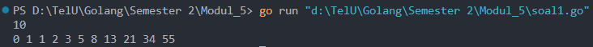
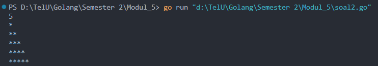
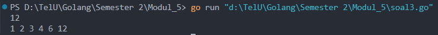
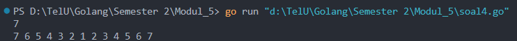
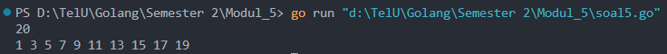
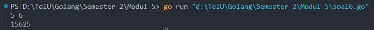

<h1 align="center">Laporan Praktikum Modul 4 <br> REKURSIF </h1>
___
<h5 align="center">Nanda Bagus Priambodo - 103112430007 </h5>
### Dasar Teori Rekursif

Rekursif adalah suatu teknik dalam pemrograman di mana sebuah fungsi memanggil dirinya sendiri untuk menyelesaikan suatu masalah, biasanya dengan membagi masalah tersebut menjadi sub-masalah yang lebih kecil dan lebih sederhana. Pendekatan ini sering digunakan untuk menyelesaikan masalah yang dapat didefinisikan dalam bentuk yang lebih kecil dari masalah itu sendiri, seperti dalam perhitungan deret Fibonacci, pencarian dalam struktur data pohon, atau penghitungan faktorial. Dalam implementasinya, fungsi rekursif biasanya memiliki dua komponen penting: kondisi dasar (base case) yang menghentikan rekursi dan mencegah terjadinya loop tak berujung, serta langkah rekursif yang memanggil fungsi itu sendiri dengan argumen yang lebih kecil. Meskipun rekursi dapat membuat kode lebih ringkas dan mudah dibaca, penggunaan yang tidak hati-hati dapat menyebabkan masalah seperti tumpukan panggilan (stack overflow) jika kedalaman rekursi terlalu besar.

### Unguided
___
#### Soal Latihan Modul 5

##### soal 1

Deret fibonacci adalah sebuah deret dengan nilai suku ke-0 dan ke-1 adalah 0 dan 1, dan nilai suku ke-n selanjutnya adalah hasil penjumlahan dua suku sebelumnya. Secara umum dapat diformulasikan 𝑆𝑛=𝑆𝑛−1+𝑆𝑛−2 . Berikut ini adalah contoh nilai deret fibonacci hingga suku ke-10. Buatlah program yang mengimplementasikan fungsi rekursif pada deret fibonacci tersebut.

```go
package main
import "fmt"

func fibonacci(n int) int {
    if n == 0 {
        return 0
    } else if n == 1 {
        return 1
    }
    return fibonacci(n-1) + fibonacci(n-2)
}

func main() {
    var n int

    fmt.Scan(&n)
    for i := 0; i <= n; i++ {
        fmt.Print(fibonacci(i), " ")
    }
}
```

  
>Code di atas merupakan code rekursif dimana terdapat perulangan pada function fibonacci yang terdapat sebuah base case dimana jika n sama dengan 0 maka nilai yang di balikan adalah 0 dan jika nilai n adalah 1 maka nilai yang di balikan adalah 1 dan setelah melewati base case akan ada return dimana n akan di kurangi - lalu n akan di tambah bilangan n - 2 lalu value atau nilai akan di lempar ke dalam fungsi main lalu akan di eksekusi oleh perulangan hingga atau sebanyak n yang telah di masukkan oleh user

```go
func fibonacci(n int) int {
    if n == 0 {
        return 0
    } else if n == 1 {
        return 1
    }
    return fibonacci(n-1) + fibonacci(n-2)
}
```

##### soal 2

Buatlah sebuah program yang digunakan untuk menampilkan pola bintang berikut ini dengan menggunakan fungsi rekursif. N adalah masukan dari user.

```go
package main
import "fmt"

func bintang(a int) {
    if a != 0 {
        fmt.Print("*")
        bintang(a - 1)
    }
}

func cetak(a, baris int) {
    if baris <= a {
        bintang(baris)
        fmt.Println()
        cetak(a, baris+1)
    }
}

func main() {
    var a int

    fmt.Scan(&a)

    cetak(a, 1)
}
```
 
>Code di atas merupakan code rekursif dimana terdapat pemanggilan function nya sendiri pada function bintang dan cetak
```go
func bintang(a int) {
    if a != 0 {
        fmt.Print("*")
        bintang(a - 1)
    }
}

func cetak(a, baris int) {
    if baris <= a {
        bintang(baris)
        fmt.Println()
        cetak(a, baris+1)
    }
}
```
>Function Bintang
>Untuk mencetak banyak bintang yang akan di cetak otak user dan terdapat base case dimana jika a sudah mencapai 0 maka tidak ada perintah yang akan di jalankan
>
>Function Cetak:
>Untuk memberikan space dan mencetak banyaknya bintang untuk menjadi output dan akan di panggil oleh fungsi utama yaitu fungsi main

##### soal 3

Buatlah program yang mengimplementasikan rekursif untuk menampilkan faktor bilangan dari suatu N, atau bilangan yang apa saja yang habis membagi N.
Masukan terdiri dari sebuah bilangan bulat positif N.
Keluaran terdiri dari barisan bilangan yang menjadi faktor dari N (terurut dari 1 hingga N ya).

```go
package main
import "fmt"

func faktor(a, i int) {
    if i > a {
        return
    }

    if a%i == 0 {
        fmt.Print(i, " ")
    }
    faktor(a, i+1)
}

func main() {
    var a int

    fmt.Scan(&a)

    faktor(a, 1)
}
```


>Code di atas adalah program dimana user mencari faktor dari bilangan bulat yang dimasukan, pada fungsi main terdapat inputan dan terdapat fungsi faktor yang menjadi fungsi rekursif sebagai berikut

```go
func faktor(a, i int) {
    if i > a {
        return
    }

    if a%i == 0 {
        fmt.Print(i, " ")
    }
    faktor(a, i+1)
}
```

>Pada function di atas terdapat rekursif yaitu pada bagian pemanggilan faktor(a, i+1) yang berarti fungsi a akan di kembalikan atau di cetak dan i akan di tambah 1 untuk mencari faktor selanjutnya akan akan di bandingkan oleh basecase, jika i melebihi a(inputan user) maka otomatis akan berhenti dan akan mengembalikan fungsi atau return

##### Soal 4

Buatlah program yang mengimplementasikan rekursif untuk menampilkan barisan bilangan tertentu.
Masukan terdiri dari sebuah bilangan bulat positif N.
Keluaran terdiri dari barisan bilangan dari N hingga 1 dan kembali ke N.

```go
package main

import "fmt"  

func barisan(n, angka int) {
    fmt.Print(angka, " ")

    if angka > 1 {
        barisan(n, angka-1)
        fmt.Print(angka, " ")
    }
}

func main() {

    var n int

    fmt.Scan(&n)

    barisan(n, n)

}
```



>Program di atas menggunakan rekursif pada function barisan karena terdapat pemanggilan kembali fungsi pada barisan(n, angka - 1)


##### Soal 5

Buatlah program yang mengimplementasikan rekursif untuk menampilkan barisan bilangan ganjil.
Masukan terdiri dari sebuah bilangan bulat positif N.
Keluaran terdiri dari barisan bilangan ganjil dari 1 hingga N.

```go
package main
import "fmt"

func ganjil(a, i int) {

    if i > a {
        return
    }

    if i%2 != 0 {
        fmt.Print(i, " ")
    }
    ganjil(a, i+1)

}

func main() {

    var a int
    fmt.Scan(&a)
    ganjil(a, 1)

}
```



>Program di atas merupakan program mencari angka ganjil dari 1 hingga n (inputan user), pada function main terdapat sebuah inputan user lalu pemanggilan function yaitu ganjil yang di muali dari angka 1 

```go
func ganjil(a, i int) {

    if i > a {
        return
    }

    if i%2 != 0 {
        fmt.Print(i, " ")
    }
    ganjil(a, i+1)

}
```

>Percabanga awal adalah basecase dimana jika i sudah melebihi inputan user maka basecase akan menghentikan. Lalu pada basecase yang kedua kita dapat mencari bilangan ganjil dari 1 jika tidak habis di bagi oleh 2 maka i akan di eksekui sebagai output lalu rekursif atau pemanggilan function pada ganjil( a, i+1) adalah pemanggilan lalu value i akan di tambah 1 hingga batas dari basecase di atas.

##### Soal 6

Buatlah program yang mengimplementasikan rekursif untuk mencari hasil pangkat dari dua buah bilangan.
Masukan terdiri dari bilangan bulat x dan y.
Keluaran terdiri dari hasil x dipangkatkan y.
Catatan: diperbolehkan menggunakan asterik "*", tapi dilarang menggunakan import "math"

```go
package main

import "fmt"

func pangkat(x, y int) int {

    if y == 0 {
        return 1
    }

    return x * pangkat(x, y-1)
}

func main() {
    var x, y int
    fmt.Scan(&x, &y)
    fmt.Println(pangkat(x, y))
}
```

